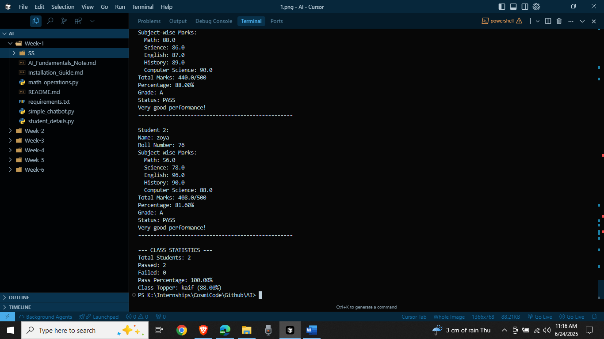
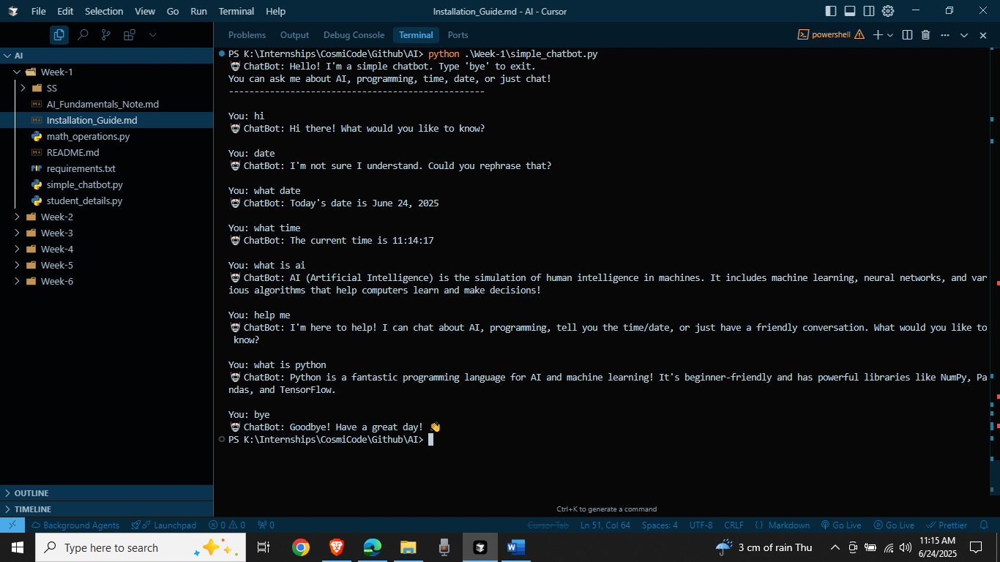
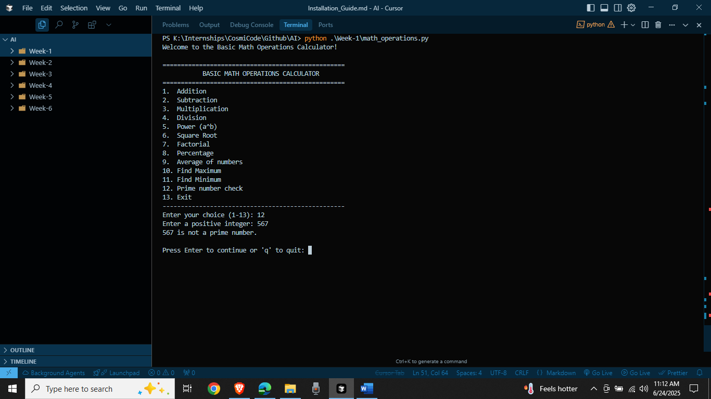

# Week 1: Introduction to AI & Python for AI

## Overview
This week covers AI fundamentals and basic Python programming for AI applications.

## Tasks Completed

### 1. AI Fundamentals Note (📝 `AI_Fundamentals_Note.md`)
A comprehensive 300-word explanation covering:
- What is AI?
- Types of AI (Narrow/General/Super AI, Reactive/Limited Memory/Theory of Mind/Self-Aware)
- Real-world applications in healthcare, transportation, technology, entertainment, and agriculture

### 2. Installation Guide (🔧 `Installation_Guide.md`)
Step-by-step guide to install:
- Python 3.8+
- Jupyter Notebook
- Essential libraries: NumPy, Pandas, Matplotlib, Seaborn

### 3. Student Details Program (🎓 `student_details.py`)
Interactive program featuring:
- Input validation for student information
- Grade calculation with if-else conditions
- Loop-based data collection for multiple students
- Statistical analysis (class average, pass/fail rates)
- Performance feedback system

**How to run:**
```bash
python student_details.py
```

**Screenshot:**


### 4. Simple Chatbot (🤖 `simple_chatbot.py`)
Rule-based chatbot with:
- Greeting and conversation responses
- Time and date queries
- AI and programming discussions
- Basic math calculations
- Pattern-based response system using if-else

**How to run:**
```bash
python simple_chatbot.py
```

**Screenshot:**


### 5. Math Operations Calculator (🧮 `math_operations.py`)
Comprehensive calculator with functions for:
- Basic operations: +, -, ×, ÷
- Advanced: power, square root, factorial
- Statistical: average, min, max, percentage
- Prime number checker
- Input validation and error handling

**How to run:**
```bash
python math_operations.py
```

**Screenshot:**


## Quick Setup

1. **Install Python packages:**
```bash
pip install -r requirements.txt
```

2. **Run any program:**
```bash
python <program_name>.py
```

3. **Launch Jupyter Notebook:**
```bash
jupyter notebook
```

## Learning Objectives Achieved
✅ Understanding AI fundamentals and applications  
✅ Python environment setup for AI development  
✅ Control structures (if-else, loops)  
✅ Function-based programming  
✅ User input validation  
✅ Error handling  
✅ Interactive program development 